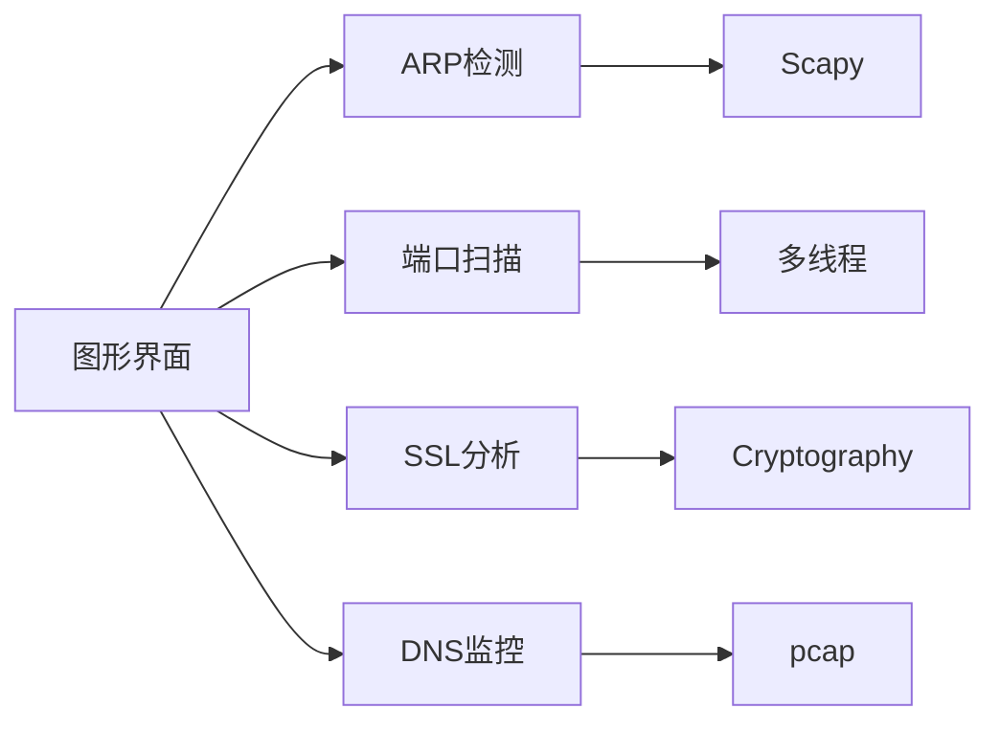

# 网络安全工具集

## 功能特性
- ARP欺骗实时检测与告警
- 多线程TCP端口扫描（支持1-65535端口范围）
- SSL/TLS证书链分析（支持TLS 1.3）
- DNS查询流量监控与统计分析
- 图形化界面操作（基于PyQt6）
- 自动权限检测与sudo认证

## 核心模块


```

## 核心功能
| 模块 | 技术特性 | 性能指标 |
|------|----------|----------|
| ARP检测 | Scapy实时抓包分析 | 15包/秒阈值 |
| 端口扫描 | SYN/ACK多线程扫描 | 50并发线程 |
| SSL分析 | TLS 1.3全支持 | OCSP装订验证 |
| DNS监控 | TCP/UDP双协议解析 | 智能域名过滤 |

### 模块技术实现
1. **ARP欺骗检测模块**  
   - 使用Scapy库监听ARP响应包
   - 建立MAC-IP绑定数据库
   - 异常流量阈值：15包/秒
   - 实时告警推送桌面通知

2. **SSL/TLS分析器**  
   - 基于cryptography解析证书链
   - 支持SNI扩展检测
   - 证书有效性检查（OCSP装订）
   - 支持TLS 1.3协议分析

3. **智能端口扫描器**  
   - 自适应TCP SYN/ACK扫描
   - 服务指纹识别（nmap风格）
   - 多线程池管理（默认50线程）
   - 结果自动分类存储

4. **DNS流量监控**  
   - libpcap原始套接字捕获
   - 支持53端口UDP/TCP协议
   - 查询类型统计分析
   - 异常域名模式检测

- ARP欺骗实时检测与告警
- SSL/TLS证书链分析
- 多线程端口扫描器
- DNS查询流量监控
- 友好的GUI操作界面

## 环境要求
- Python 3.8+ (推荐3.10+)
- PyQt6 ≥6.4
- Scapy ≥2.5.0
- cryptography ≥41.0.3
- 系统要求：
  - Linux: libpcap-dev, tshark
  - Windows: WinPcap 4.1.3+
  - macOS: libpcap via Homebrew

## 安装指南
```bash
# 创建虚拟环境
python -m venv venv
source venv/bin/activate  # Linux/macOS
venv\Scripts\activate  # Windows

# 安装依赖
pip install -U pip setuptools
pip install -r config/requirements.txt

# 运行测试套件
pytest tests/ -v

# 启动图形界面
python src/main.py
```

## 配置示例
```python
# config.py
DEBUG = False
MAX_THREADS = 50
SNIFFER_TIMEOUT = 30  # 抓包超时时间(秒)
SSL_ALLOWED_VERSIONS = ['TLSv1.3', 'TLSv1.2']
```

## 使用说明
### ARP检测
1. 选择网络接口（默认自动选择首选接口）
2. 点击"开始检测"按钮
3. 实时显示ARP响应频率和可疑活动

### 端口扫描
1. 输入目标IP地址（支持域名解析）
2. 设置扫描端口范围（默认1-1024）
3. 选择线程数量（默认50线程）
4. 查看实时扫描结果

### SSL/TLS分析
1. 输入目标地址（格式：domain:port）
2. 点击分析按钮获取证书链信息
3. 查看支持的加密套件列表
4. 验证OCSP装订状态

### DNS监控
1. 点击"开始监控"按钮
2. 实时显示DNS查询记录
3. 支持过滤特定域名类型（A/AAAA/CNAME）
1. 启动程序
```bash
# 普通用户模式
python main.py

# 需要抓包权限的模式（Linux/macOS）
sudo python main.py
```

### 功能模块详解

#### 1. ARP欺骗检测模块
**参数说明**:
- 网络接口名称：
  - 有线网络示例：eth0/en0
  - 无线网络示例：wlan0/wlp3s0
  - 可使用`ifconfig`(Unix)或`ipconfig`(Windows)查询

**操作流程**:
1. 在接口输入框输入网络接口名称
2. 点击【开始检测】启动监控
3. 检测到异常时，界面会：
   - 弹出桌面通知
   - 日志区显示红色告警信息
   - 流量图表显示实时波动

**配置示例**:
```
# 家庭无线网络环境
接口名称：wlan0
检测阈值：15包/秒

# 企业有线网络环境 
接口名称：eth0
检测阈值：30包/秒
```

#### 2. 智能端口扫描器
**参数规范**:
- 目标IP格式：
  - IPv4地址（192.168.1.1）
  - 域名（example.com）
- 端口范围：
  - 单端口：80
  - 连续范围：1-1024
  - 多个范围：80,443,8000-8080

**界面指引**:
1. 目标地址输入框支持CIDR格式（192.168.1.0/24）
2. 点击【导出结果】可生成CSV报告
3. 进度条显示当前扫描完成度

**典型场景**:
```
# 快速扫描常用端口
目标IP：10.0.0.1
端口范围：21,22,80,443,3389

# 全面扫描测试环境
目标IP：192.168.56.102
端口范围：1-65535
```

#### 3. SSL/TLS分析器
**高级参数**:
- 支持指定SSL版本：
  - TLS 1.2（默认）
  - TLS 1.3
  - 兼容模式
- 证书链深度检测：
  - 完整验证（默认）
  - 快速验证

**操作演示**:
1. 输入目标域名：example.com:443
2. 勾选【深度分析】复选框
3. 点击【开始分析】后：
   - 显示证书颁发机构链
   - 标红显示过期证书
   - 显示支持的加密套件

#### 4. DNS监控模块
**网络环境配置**:
```
# 企业网络环境（镜像端口）
监控接口：eth0
过滤规则：port 53

# 无线热点环境
监控接口：wlan0
过滤规则：udp and port 53
```

**界面元素说明**:
- 【开始监控】按钮：启动DNS查询捕获
- 【过滤设置】按钮：设置域名白名单
- 【导出日志】按钮：保存查询记录
- 统计面板：显示各类型查询占比

### 典型应用场景

#### 场景1：内网ARP欺骗检测
1. 选择有线接口eth0
2. 设置检测阈值为20包/秒
3. 持续监控10分钟后...
4. 发现192.168.1.15的异常ARP响应
5. 使用【导出证据】功能保存日志

#### 场景2：外网SSL证书分析
1. 输入https://example.com
2. 选择TLS 1.3协议版本
3. 发现证书链不完整告警
4. 使用【保存报告】生成PDF分析结果

#### 场景3：无线网络端口扫描
1. 连接wifi_guest网络
2. 扫描192.168.0.1-192.168.0.254
3. 发现192.168.0.102开放异常端口31337
4. 使用【标记风险】功能记录可疑主机

## 注意事项

### 法律声明与使用规范
1. 本工具仅限授权测试使用
2. ARP检测功能不可用于主动扫描他人网络
3. 端口扫描需获得目标明确授权
4. 禁止将本工具用于非法渗透测试

### 界面操作指引
```
[主界面示意图]
+-----------------------------+
| 网络接口选择 | 开始监控按钮 |
+-----------------------------+
| 实时流量图表区域            |
+-----------------------------+
| 事件日志列表（可导出CSV）   |
+-----------------------------+
```

- 启动时自动检测权限，权限不足时会弹出可视化警告窗口
- 执行需要权限的功能时会进行二次确认提示
- 部分功能需要管理员权限运行（需使用sudo启动程序）
- ARP检测仅支持有线网络接口
- 端口扫描请遵守当地网络安全法规
- SSL分析支持标准443端口服务

## 快速入门
```bash
# macOS环境安装（需Homebrew）
brew install libpcap
python3 -m pip install -r requirements.txt
```

## 界面预览

> macOS 12+系统运行效果（1920x1080分辨率）

## 许可证
MIT License

## 贡献指南
欢迎提交Issue和Pull Request，请遵循现有代码风格